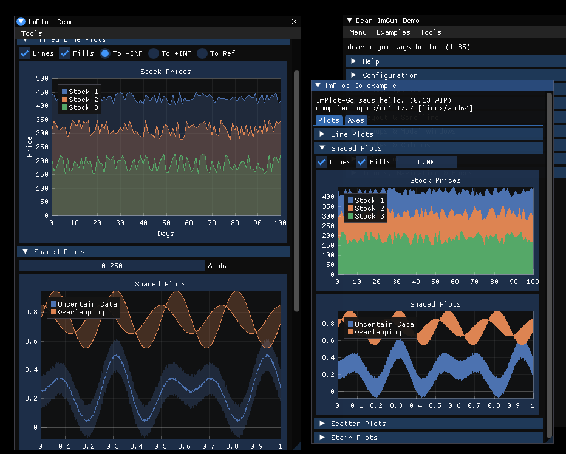

## Example for ImPlot for Go

This is a ready-to-run example for [implot-go](https://github.com/Edgaru089/implot-go/) using a modified backend from
github.com/inkyblackness/imgui-go-examples, namely the GLFW/OpenGL3 one.
It has been modified for my own use and was ripped out of a larger project,
so there are some other random packages kept together with it.

Surely enough you can take any backend/renderer combo from [imgui-go-examples](github.com/inkyblackness/imgui-go-examples) and add ImPlot code to it, or write your own. Things should work out of the box for ImPlot, at least with the current way Go links C libraries.

### Usage

Just type `go run .` to run the example.

The file `example.go` should interest you the most housing example Go code for the ImPlot-Go window.

### License

MIT.

Part of the code in `backend/` is from [imgui-go-examples](https://github.com/inkyblackness/imgui-go-examples), under the [New BSD License](https://github.com/inkyblackness/imgui-go-examples/blob/main/LICENSE).
